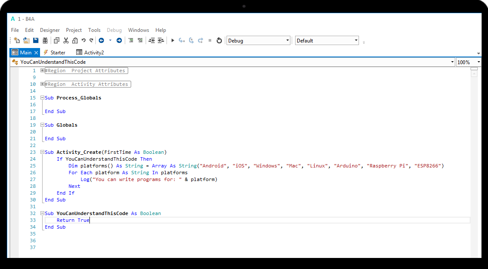

  


## Programmiersprache  
AWTRIX und seine Apps sind in B4X geschrieben. 
B4X verwendet einen proprietären Dialekt von Visual Basic (im Folgenden "B4X" genannt).

## IDE (Entwicklungsumgebung)
B4J ist ein modernes "VB6-ähnliches" und 100% kostenloses Entwicklungswerkzeug für plattformübergreifende Desktop-, Server- und IoT-Lösungen.
Die kompilierten Apps können auf Windows-, Mac-, Linux- und ARM-Boards (z.B. Raspberry Pi) ausgeführt werden. Die kompilierten Apps sind native Java-Anwendungen.  
  
[Download B4J](https://www.b4x.com/b4j.html)


## Apps definition
AWTRIX Apps sind Java-Bibliotheken, die zur Laufzeit geladen werden können.
Definierte Funktionen, die von AWTRIX aufgerufen werden, übertragen die Informationen auf die Matrix.

# Erste Schritte
Für die erste App ist es besser, mit dem Template zu beginnen [Download](https://github.com/awtrix/AWTRIX2.0-Apps/tree/master/templateApp)  
Nachdem du die Template.b4j mit B4J geöffnet hast, sollte das ganze so aussehen:  
  


Zuerst solltest du deiner App einen eindeutigen namen geben.  
Vorraussetzungen der Namensgebung:
- Keine Umlaute
- Keine Leerzeichen
- Keine Sonderzeichen
- Dieser Name ist noch nicht von einer anderen App vergeben

Der Appname muss als erstes an 4 Punkten eingetragen werden:
- In der Main-klasse ```#LibraryName:Template```
- Wechsel in die Template-Klasse und drage dort in der Funktion ```Public Sub Initialize() As String``` deinen Appnamen in ```App.name = "Template"``` ein
- Gehe auf Projekt-> Modul umbennenen und gib dieser Klasse deinen Appnamen
- Speichere das Projekt an einem neuen Ort mit dem selben Appnamen ab
