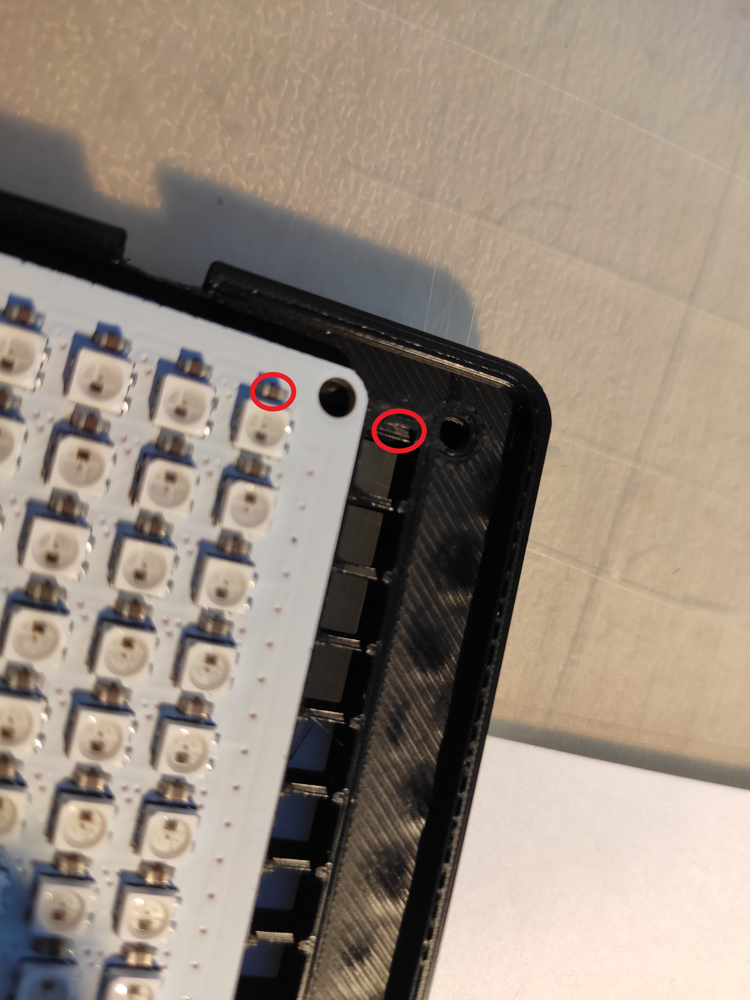
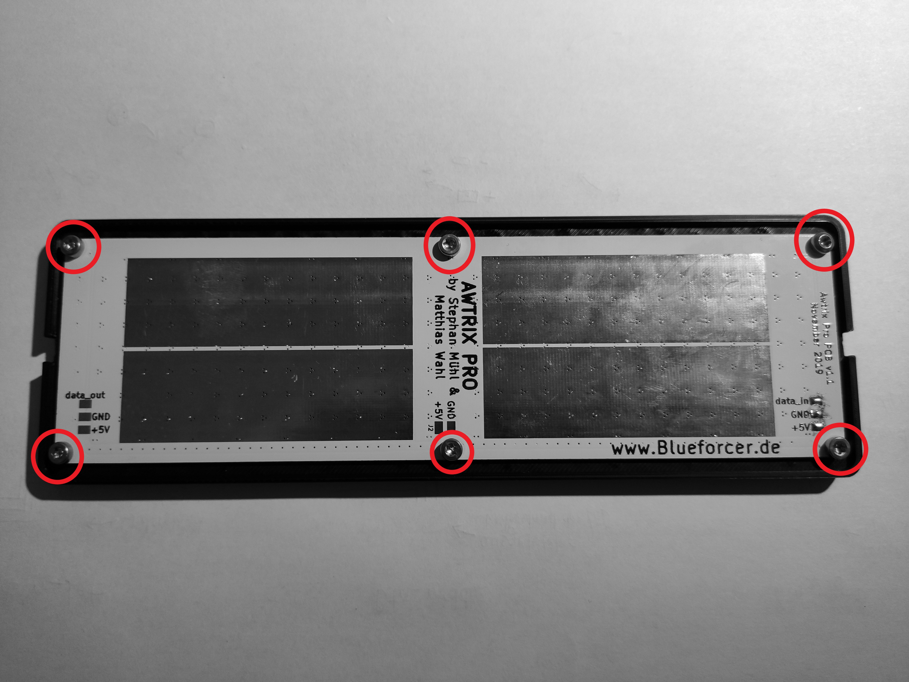

## Awtrix PRO
Would you like to take your previous Awtrix experience to a whole new level? Then the Awtrix Pro is exactly what you need. In addition to the integrated sound output, you can now control your matrix via touch sensors on the top of the case. The much more compact design and the use of a professional SLA print makes the matrix look much more elegant.
Awtrix PRO is a further development of the previous large Awtrix and differs essentially only in size. Both versions have the same range of functions. Only the case of the Pro is already prepared by us for all external hardware.

The software and the new (white) mainboard are the same for both devices, so there is no need to differentiate further. The matrix that is used here is a complete in-house development, as it is not yet available on the market in this form. 


## What is new?
- Smaller Matrix (190 x 55 mm)
- Three buttons on the top of the case
- Brightness sensor integrated in housing
- Raspberry Pi (Pi 3, Pi 4) can be optionally integrated into the housing
- new mainboard integrated in the housing
- 3W full-range loudspeaker integrated in housing


# Case

You can find the necessary files for 3D printing of the case on [Thingiverse](https://www.thingiverse.com/thing:4155357).

A 2mm thick Plexiglas panel is provided as the front panel. You can find the matching DXF for milling on Thingiverse. This is not yet for official sale.
  
  <div align=center>
  
  </div>

# Elecctronic
## Parts list

!> **General note**
The availability of the articles changes daily. Therefore it may happen that some articles are no longer available under the link. However, the parts are available from many dealers. Just search on Amazon, Ebay or Aliexpress.

In our shop you can buy the PCBs. You can order them either individually, i.e. without parts, or as a kit. With the purchase of this hardware (this is not mandatory) you support us in the further development of Awtrix & Awtrix Pro.


### Required components
| No | Name | Link |
| - |:------------------------:| :------------------------------:|
| 1 | Awtrix Mainboard Kit | [Click here](https://blueforcer.de/produkt/awtrix-mainboard-2-0-bausatz/) |
| 2 | Per Matrix | [Click here](https://blueforcer.de/produkt/awtrix-pro-matrix/) |
| 3 | Awtrix housing | [Click here](https://www.thingiverse.com/thing:4155357) |
| 4 | Wemos D1 mini | [Click here](https://de.aliexpress.com/item/32651747570.html) |
| 5 | Power supply (>3A) | [Click here](https://goo.gl/QLydM3) |
| 6 | power jack | [click here](https://goo.gl/j4Xov7) |


### Optional components
| No | Name | Link |
| - |:------------------------:| :------------------------------:|
| 1 | LDR GL5528 | [Click here](https://de.aliexpress.com/item/32515315072.html) |
| 2 | DF Mini Player | [Click here](https://de.aliexpress.com/item/32992229288.html) |
| 4 | loudspeakers | [Click here](https://de.aliexpress.com/item/32853811267.html) |

The touch sensors are not listed here because they are part of the Awtrix mainboard kit and therefore do not need to be purchased.


# Mainboard

The mainboard is already labeled and the components can be soldered directly to the pads or connected/plugged via pin headers.


**Detailed instructions on how to assemble the mainboard [can be found here](/en-en/pcb.md)**

If you have soldered pin headers, you can already mount the mainboard, speakers and the Raspberry into the case. Otherwise you should solder everything together before you install it. The DC jack should be installed before soldering to be able to mount the locknut.

!> Do not use thin cables for the power supply of the mainboard and the matrix, because relatively high currents flow here and the voltage drop can be too high due to thin cables. This can lead to problems.

## AWTRIX Pro Matrix

This matrix was developed primarily for AWTRIX. In order to save production costs, an aluminium core has been omitted from the circuit board.
Instead, the rear side was generously provided with ground planes to dissipate the heat. However, the matrix is not designed for full LED power.

!> Never drive all 256 LEDs at once for a long time at high brightness. This can cause damage to the matrix due to the heat development.

The large ground plane acts like a bi-metal, which causes a slight deformation of the board in the reflow oven (Soldering process). This has no effect on the functionality of the LED and is straightened by the screw connection in the housing.


## Touch sensors 

!> The touch sensors have two bridges on the small circuit board which can be closed with solder. This is absolutely necessary for the middle sensor, otherwise the Wemos will not start. To prevent this from happening the bridge A of the **middle touch sensors must be closed**. This will set the I/O pin to active low. 
  <div align=center>
  
  </div>


## Serial connection or USB connection to the matrix

Since AWTRIX is built into the case, it is possible to connect the Raspberry directly to the motherboard via serial. Here the Raspberry is also powered by the mainboard.

> The Wemos still requires a connection to a network.
The WiFi connection is used to continue to update the controller and as a fallback if no data is transferred via serial.

For this purpose the Pi is connected to the mainboard as follows:


| Raspberry Pin-No | Mainboard (Raspberry Serial header) |
| ---------------- | -------- |
| 04 - 5V | +5V) |
| 06 - GND | GND |
| 08 - TXD | Rx
| 10 - RXD | Tx |

!> **Please pay attention to the Raspberry version. Here there can be differences! **

By default, the serial interface must be enabled for the Raspberry. With the Raspberry 3 you can do this with the following commands:
```
 sudo raspi-config nonint do_serial 1
 sudo raspi-config nonint set_config_var enable_uart 1 /boot/config.txt
 sudo reboot
```

## DFPlayer

The DFPlayer is used for the output of sounds and can be used optionally. It stores mp3 files on a memory card, which is inserted into the micro SD slot of the player. This allows you to have your matrix speak to you or play sounds when you are notified.  
  
You need to create a folder "MP3" on your DFplayer SD card and move your mp3s to this folder. The mp3 must start with a 4-digit number, e.g. **0001.mp3** or **0001 - Testfile.mp3**.  
AWTRIX uses the range 0001-0100 for internal purposes. Start with own mp3s at 0101.  
[Download default sounds](https://blueforcer.de/awtrix/Soundfiles.zip)

# Picture instructions for assembly

These instructions do not refer to the installation of a Raspberry Pis. Please take the correct wiring from above.

## 1. Touch Sensors
- The resistor of the LED on the touch button can be optionally soldered out.
- If the housing is bright, the light of the LED can otherwise be seen from outside.
- The LED on the middle button lights up permanently if the resistor is not removed.
- The touch sensors theoretically fit perfectly into the 3 receptacles. However, due to pressure tolerances it may be necessary to fix them with double-sided adhesive tape or to smooth the boards slightly with sandpaper on the sides.

### 1.1 Left Touch Sensor (btn_left)
- Cut 3 cables to approx. 14cm length. If available, three different colours. 
- Strip, twist and tin the cable ends on both sides for approx. 2mm.
- DO NOT insert the cable through the holes of the Touch Sensor, but only from above and solder it on. (black = GND ; red = 3.3V/VCC ; green = Data/IO)
- When plugging through, the cable ends on the other side are too wide and prevent an optimal placement of the sensor in the housing
- Solder the other ends to the mainboard. Put the cables through the holes provided for this - gives more stability.


### 1.2 Middle Touch Sensor (btn_middle)
- Cut 3 cables to approx. 14cm length. If available, three different colours. 
- Strip, twist and tin the cable ends on both sides for approx. 2mm.
- DO NOT insert the cable through the holes of the Touch Sensor, but only from above and solder it on. (black = GND ; red = 3.3V/VCC ; green = Data/IO)
- When plugging through, the cable ends on the other side are too wide and prevent an optimal positioning of the sensor in the housing
- close the bridge! Otherwise the Wemos D1 mini will not start.
- Solder the other ends to the mainboard. Put the cables through the holes provided here - gives more stability.


### 1.3 Right Touch Sensor (btn_right)
- Cut 3 cables to approx. 14cm length. If available, three different colours. 
- Strip, twist and tin the cable ends on both sides for approx. 2mm.
- DO NOT insert the cable through the holes of the Touch Sensor, but only from above and solder it on. (black = GND ; red = 3.3V/VCC ; green = Data/IO)
- When plugging through, the cable ends on the other side are too wide and prevent an optimal placement of the sensor in the housing
- Solder the other ends to the mainboard. Put the cables through the holes provided for this - gives more stability.


## 2. LDR / light sensor
- Cut 2 cables to approx. 7cm length. Can be used two times the same color, as there is no polarity.
- Strip, twist and tin both ends of the cable for approx. 2mm.
- Shorten the legs of the LDR to about 3-4mm and solder them to the cables.
- Solder the other ends to the mainboard. Here put the cables through the holes provided for it - gives more stability.
- As already mentioned the polarity of the LDR is not relevant. 


## 3. speaker
- The speaker we use has a polarity. This must be observed.
- Cut the red cable to about 11cm, cut the black cable to about 13cm. Cable lengths are only correct here if the speaker is installed exactly as described in this manual!
- solder the red cable to the plus of the speaker
- solder the black wire to the minus of the speaker
- The cables are soldered on the mainboard under "Speaker". Red cable to the rectangular pin, black cable to the oval pin. 
- You can simply put the speaker into the recess and therefore you don't have to fix it further.


## 4. DC jack
- With the DC jack it is especially important to observe the polarity.
- Cut 2 cables to approx. 8cm length. Use two different colours. (black = GND ; red = +5V)
- Solder the cable to the DC socket. Solder red to the middle contact (+5V), black to the outer contact (GND).
- Then screw the socket into the housing.
- Now the other ends can be connected to the mainboard. (black = GND ; red = +5V)
- Check the connection again because otherwise the matrix will be damaged.


"
[!PIC](../assets/manualPicture/case/socket3.jpg)


## 5. Mounting Matrix
- The matrix is screwed to the grid with 6 screws (M3x4).
- Tighten the screws only very slightly. Otherwise the matrix can be damaged and the plastic threads in the grid can be broken.
- Pay attention to the direction when inserting the matrix into the grid. For each capacitor there is a recess in the grid. If you have the matrix in front of you in the right direction, you will see no capacitors on the left side of the grid, while capacitors are on the right side. In the grid there is a side where there are no cutouts on the outside. These must correspond with the matrix!





## 6. Matrix
- Cut 3 cables to approx. 12cm length. If available, three different colours. (black = GND ; red = +5V ; green = Data/data_in)
- Solder cables to the matrix. It is especially important that the three contacts for connection are selected in which "data_in" occurs. (black = GND ; red = +5V ; green = data_in)
- Then solder the cables on the mainboard at the label "Matrix". (black = GND ; red = +5V ; green = Data)
- Check the connection again because otherwise the matrix will be damaged.


## 7. motherboard
- The mainboard is fixed in the case with four screws (M3x4).
- Tighten the screws only very slightly. Otherwise the plastic thread in the grid can break.


## 8. insert grid into the housing
- Now it's time to close the case and put the matrix into operation.
- If your Wemos D1 mini has not been recorded with the controller software at this point, do so before closing the case!
- Place the case so that the touch buttons and the LDR are looking up/away from you.
- When inserting the grid into the case, the connection cables of the matrix must be on the left side.


## 9. FINISHED
- Do you have any questions? Then please ask them in the forum. Other users may benefit from public questions.
- Show us your finished matrix on Facebook or in the forum.
- Have fun with your matrix!

